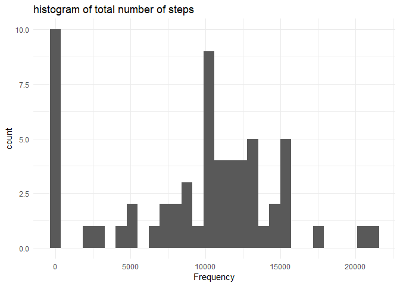
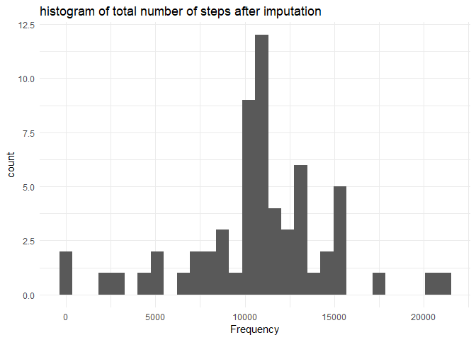
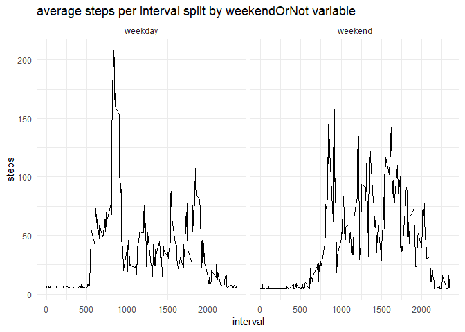

## Loading and preprocessing the data

Loading packages:


```r
library(dplyr)
library(readr)
library(ggplot2)
```

Load data into the environment in R with read_csv():


```r
filename <- 
        "activity"
## url to file on coursera web site
url <- "https://d396qusza40orc.cloudfront.net/repdata%2Fdata%2Factivity.zip"
## create folder if it does not already exist or else tell us
folder <- paste0(getwd(), "/",filename)
if (!dir.exists(folder)) {
        dir.create(folder)
        print("folder created")
} else {
        print("folder exists")
}
```

```
## [1] "folder created"
```

```r
## Construct path for storing file in local directory
dest <- file.path(folder, paste0(filename,".zip"))
## Download if it does not exist else tell us
if (file.exists(dest)) {
        print("file already exist")
} else {
        download.file(url, dest, quiet = TRUE)
        ## unzip and load file to R environment
        utils::unzip(dest, exdir = folder)
        print("file downloaded and extracted")
}
```

```
## [1] "file downloaded and extracted"
```

```r
activity <- readr::read_csv(paste0(folder, "/", filename, ".csv"))
```

```
## Parsed with column specification:
## cols(
##   steps = col_integer(),
##   date = col_date(format = ""),
##   interval = col_integer()
## )
```


A quick look at the data reveals that the columns with number of steps consists of 2.304 missing values


```r
summary(activity)
```

```
##      steps             date               interval     
##  Min.   :  0.00   Min.   :2012-10-01   Min.   :   0.0  
##  1st Qu.:  0.00   1st Qu.:2012-10-16   1st Qu.: 588.8  
##  Median :  0.00   Median :2012-10-31   Median :1177.5  
##  Mean   : 37.38   Mean   :2012-10-31   Mean   :1177.5  
##  3rd Qu.: 12.00   3rd Qu.:2012-11-15   3rd Qu.:1766.2  
##  Max.   :806.00   Max.   :2012-11-30   Max.   :2355.0  
##  NA's   :2304
```


## What is mean total number of steps taken per day?

Aggregating steps per day:


```r
stats_date <- activity %>% group_by(date) %>% 
              summarise(sumPerDay = sum(steps, na.rm = TRUE))
```

Histogram of the total number of steps taken each day


```r
ggplot2::ggplot(stats_date, aes(stats_date$sumPerDay)) + 
geom_histogram() +
ggtitle("histogram of total number of steps") +
xlab("Frequency") +
theme_minimal()
```

```
## `stat_bin()` using `bins = 30`. Pick better value with `binwidth`.
```

<!-- -->

finding the mean and median:


```r
mean <- mean(stats_date$sumPerDay, na.rm = TRUE)
median <- median(stats_date$sumPerDay, na.rm = TRUE)
print(paste("the mean of the total number of steps taken per day", mean)) 
```

```
## [1] "the mean of the total number of steps taken per day 9354.22950819672"
```

```r
print(paste("the median of the total number of steps taken per day", median))
```

```
## [1] "the median of the total number of steps taken per day 10395"
```


## What is the average daily activity pattern?

First we find the average number of steps per interval:


```r
stats_interval <- activity %>% group_by(interval) %>% 
                  summarise(mean = mean(steps, na.rm = TRUE))
```

The 5-minute interval that, on average, contains the maximum number of steps:


```r
max_interval <- filter(stats_interval, mean == max(mean))
```

```
## Warning: package 'bindrcpp' was built under R version 3.4.4
```

```r
print(paste("the maximum interval is",max_interval[1]))
```

```
## [1] "the maximum interval is 835"
```


## Imputing missing values

Number of missing values in dataset:


```r
sum(is.na(activity))
```

```
## [1] 2304
```


The missing data can be substituted with the mean:


```r
activity$steps <- ifelse(is.na(activity$steps) == TRUE, mean(activity$steps, na.rm = TRUE), activity$steps)
```

Histogram of the total number of steps taken each day after missing values are imputed:


```r
stats_date <- activity %>% group_by(date) %>% 
              summarise(sumPerDay = sum(steps, na.rm = TRUE))

ggplot2::ggplot(stats_date, aes(stats_date$sumPerDay)) + 
geom_histogram() +
ggtitle("histogram of total number of steps after imputation") +
xlab("Frequency") +
theme_minimal()
```

```
## `stat_bin()` using `bins = 30`. Pick better value with `binwidth`.
```

<!-- -->

## Are there differences in activity patterns between weekdays and weekends?

calculating average steps per interval and weekendOrNot by creating a new factor variabel (WeekendOrNot):


```r
activity$weekday <- weekdays(activity$date)
activity$weekendOrNot <- ifelse(activity$weekday == "lørdag", "weekend",
                         ifelse(activity$weekday == "søndag", "weekend", "weekday"))

stats_weekend <- activity %>% group_by(weekendOrNot, interval) %>% 
                 summarise(mean = mean(steps, na.rm = TRUE))
```


Plot the results splitted by WeekendOrNot:


```r
g_weekend <- ggplot2::ggplot(stats_weekend, aes(interval, mean)) + 
             geom_line() +
             ggtitle("average steps per interval split by weekendOrNot variable") +
             xlab("interval") +
             ylab("steps") +
             theme_minimal()
g_weekend + facet_grid(. ~ weekendOrNot)
```

<!-- -->
